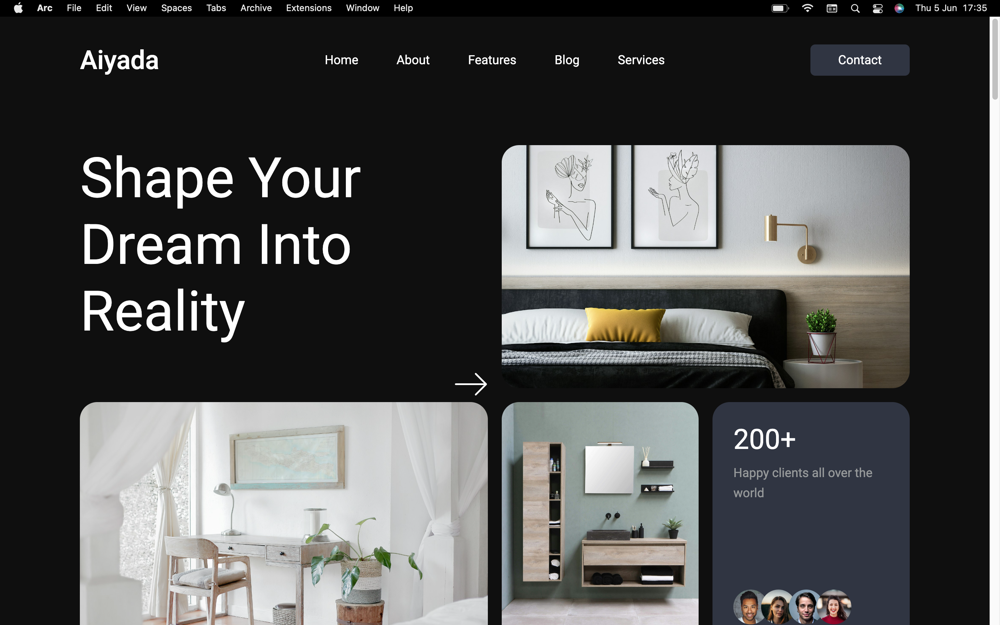

# 🛋️ Aiyada – Interior Design Landing Page

**Aiyada** is a sophisticated and responsive landing page designed for a fictional interior design studio. This project showcases a harmonious blend of aesthetic appeal and functional design, reflecting the elegance and creativity inherent in interior design.

🔗 **Live Demo**: [aiyada-ochre.vercel.app](https://aiyada-ochre.vercel.app)

---

## 📸 Visual Showcase

_Immersive Hero Section with Elegant Typography_

_Detailed About Section Highlighting Design Philosophy_

---

## 🧾 Project Overview

The **Aiyada** landing page serves as a digital portfolio for an interior design studio, aiming to captivate visitors with its minimalist design and intuitive layout. The project focuses on:

- **Visual Storytelling**: Utilizing high-quality images and thoughtful typography to convey the brand's identity.
- **User Experience**: Ensuring seamless navigation and responsiveness across devices.
- **Performance Optimization**: Implementing best practices for fast loading times and smooth interactions.

---

## 🛠️ Built With

- **HTML5**: Semantic structure for accessibility and SEO.
- **CSS3**: Styling with Flexbox and Grid for responsive layouts.
- **Sass (SCSS)**: Modular and maintainable styling approach.
- **JavaScript**: Enhancing interactivity and user engagement.

---

## 🎨 Design & UX Highlights

- **Color Palette**: Neutral tones to evoke a sense of calm and sophistication.
- **Typography**: Elegant serif fonts for headings paired with clean sans-serif for body text.
- **Layout**: Grid-based structure for balanced content distribution.
- **Imagery**: High-resolution images to showcase design projects effectively.

---

## 🚀 Features

- **Responsive Design**: Optimized for desktops, tablets, and mobile devices.
- **Interactive Elements**: Smooth scrolling and hover effects for enhanced user interaction.
- **Contact Form**: Accessible on mobile devices for user inquiries.
- **SEO-Friendly**: Semantic HTML and optimized metadata for better search engine visibility.

---

## 🧠 What I Learned

- Crafting visually appealing layouts that align with brand identity.
- Implementing responsive design techniques for various screen sizes.
- Enhancing user engagement through interactive elements.
- Optimizing web performance for faster load times.

---

## 👤 Author

**Prosper Alex**  
Front-End Developer & Designer  
[LinkedIn](https://www.linkedin.com/in/prosper-alex) | [Twitter](https://twitter.com/prosper_alex)

---

## 📄 License

This project is licensed under the MIT License.

---

## 📬 Contact

For inquiries or feedback, feel free to reach out via email: [prosperalex0110@gmail.com](mailto:prosperalex0110@gmail.com)
